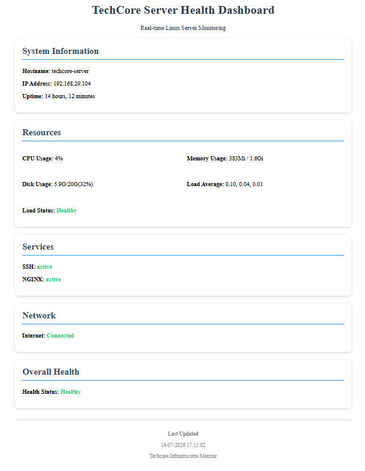

# TechCore Infrastructure Monitor

## Overview

### Problem

Checking the health of a Linux server typically requires logging in through SSH and manually running multiple commands such as `top`, `free -h`, `df -h`, `uptime`, and `systemctl status`. This process is repetitive, time-consuming, and provides no persistent overview of the server's current health.

### Solution

TechCore Infrastructure Monitor automates this process using Bash scripting and cron jobs. System metrics are collected at scheduled intervals and presented through a lightweight web dashboard served by Nginx, providing an always-available overview of the server's health.

TechCore Infrastructure Monitor is a Linux-based server monitoring platform built on **Ubuntu Server 24.04 LTS**. It collects CPU usage, memory usage, disk usage, uptime, network information, and service status, then displays the collected information through a web dashboard.

The project was built to strengthen Linux system administration, Bash scripting, automation, networking fundamentals, and server monitoring skills.

> **Note:**  
> This project was developed and tested on a single Ubuntu Server. The overall monitoring architecture is intended to be extended into a multi-server infrastructure in **TechCore v2**, currently under development.


# Features

- Automated Linux server health monitoring
- CPU usage monitoring
- Memory usage monitoring
- Disk usage monitoring
- Server uptime tracking
- Network information display
- SSH service health monitoring
- Nginx service health monitoring
- Automated dashboard updates using cron jobs
- Lightweight Bash-based monitoring solution
- Web-based monitoring dashboard


# Technologies Used

| Component | Technology |
|------------|------------|
| Operating System | Ubuntu Server 24.04 LTS |
| Scripting | Bash |
| Web Server | Nginx |
| Frontend | HTML, CSS |
| Automation | Cron |
| Version Control | Git & GitHub |


# Architecture

```text
Ubuntu Server
        │
        │
server_health.sh
(runs automatically via cron)
        │
        │
Collects:
• CPU Usage
• Memory Usage
• Disk Usage
• Uptime
• Network Information
• Service Status
        │
        │
Generates Dashboard HTML
        │
        │
Nginx Web Server
        │
        │
Web Browser
```


# Project Structure

```text
TechCore-monitor/
│
├── css/
│   └── style.css
│
├── docs/
│   ├── dashboard.png
│   └── architecture-diagram.svg
│
├── scripts/
│   └── server_health.sh
│
├── templates/
│   └── dashboard.html
│
├── README.md
└── .gitignore
```


# Directory Description

### scripts/

Contains the Bash script responsible for collecting Linux system health information including CPU usage, memory usage, disk usage, uptime, network details, and service status.

### templates/

Contains the HTML dashboard template used to display the collected monitoring information.

### css/

Contains the stylesheet used to improve the dashboard presentation.

### docs/

Contains project documentation assets including dashboard screenshots .


# Automation

The monitoring script is executed automatically using cron.

Example:

```bash
*/5 * * * * /path/to/server_health.sh
```

This keeps the dashboard updated without requiring manual execution.


# Setup

Clone the repository:

```bash
git clone git@github.com:sasidhar4711/TechCore-Infrastructure-Monitor.git
```

Navigate into the project:

```bash
cd TechCore-monitor
```

Make the monitoring script executable:

```bash
chmod +x scripts/server_health.sh
```

Run the script manually:

```bash
./scripts/server_health.sh
```

> **Note:**  
> This repository contains the project source code. Deployment requires an Ubuntu Server with Nginx and cron configured.


# Skills Demonstrated

- Linux System Administration
- Bash Scripting
- Nginx Configuration
- Cron Automation
- SSH Authentication
- Networking Fundamentals
- Process & Service Management
- File & Permission Management
- Git & GitHub


# Dashboard Preview

The dashboard displays the current Linux server health including CPU usage, memory usage, disk usage, uptime, networking information, and service status.




# What I'd Do Differently

- Store historical monitoring data instead of only displaying the current snapshot.
- Separate metric collection from HTML generation for better maintainability.
- Protect dashboard access using authentication.
- Improve the Bash script by modularizing repeated logic.
- Add basic automated testing for parsing functions.


# Future Improvements

- Historical monitoring data storage
- CPU and memory usage graphs
- Alert notifications
- Dashboard authentication
- Prometheus integration
- Grafana dashboards
- Multi-server monitoring (TechCore v2)
